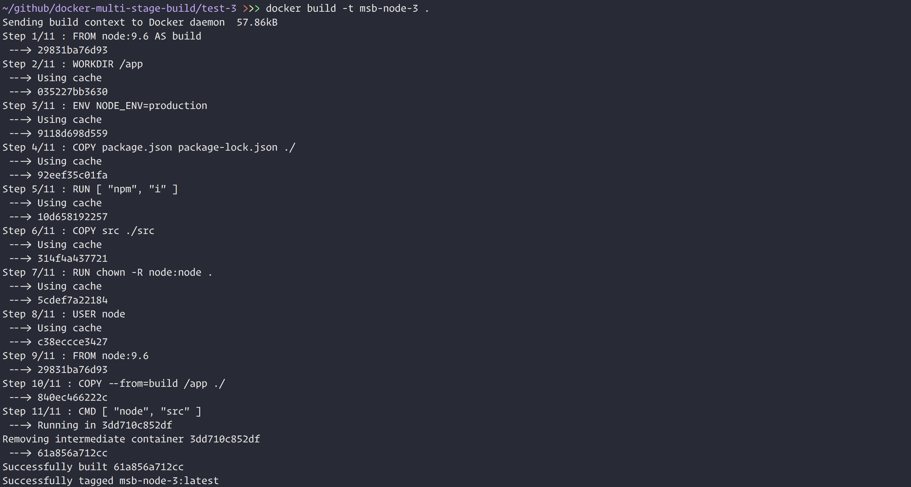
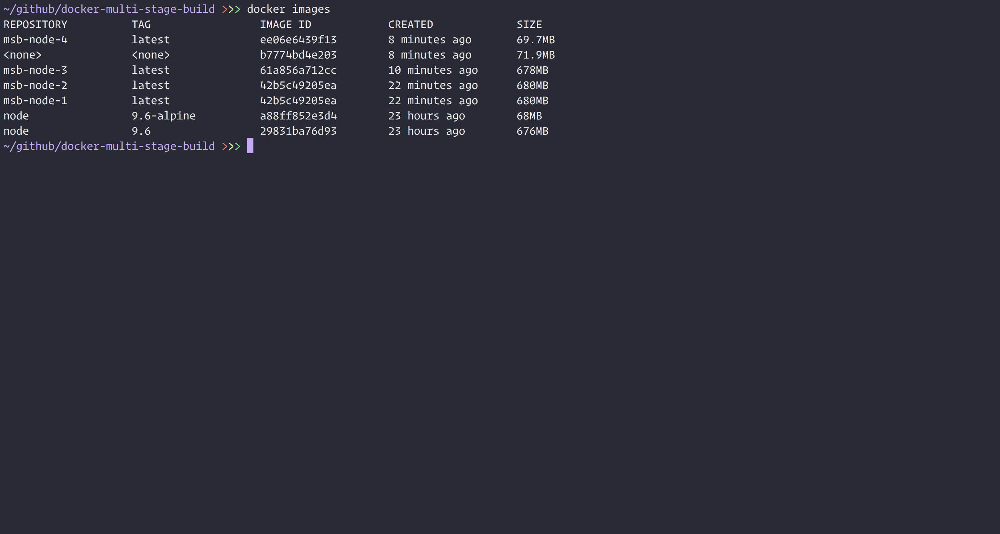

# Docker Multi Stage Builds

Experimenting with [Docker Multi Stage Builds](https://docs.docker.com/develop/develop-images/multistage-build/)
to see image size impact.

# Tests

I ran a couple of tests modifying the `.dockerignore` and `Dockerfile` using a simple Node ExpressJS
app.

## App Structure

First I ran `npm init -y`, then `npm i express` and `npm i -D eslint prettier`. After installing all
dependencies I created a `src` dir with a single file called `app.js` with the following contents:

```js
'uses strict';

const express = require('express');

const app = express();

app.use('/', function(req, res, next) {
  res.json({
    status: 'ok'
  });
});

app.listen(8888);
```

As well as a `.dockerignore`, `Dockerfile` and basic `README.md`. This gives the following structure:

```
node_modules
src/
  app.js
.dockerignore
Dockerfile
package-lock.json
package.json
README.md
```

## Test 1 - EMPTY Dockerignore, NO Multi Stage Build

First I wanted to see how the Docker Build Context is affected. Therefore I build an image with an
empty `.dockerignore` using `node:9.6` as a base image, without multi stage build.

Navigate to `/test-1` and run:

```
docker build -t msb-node-1 .
```

| DOCKER ARTIFACT | SIZE       |
| --------------- | ---------- |
| Build Context   | `23.48 MB` |
| Image           | `680 MB`   |

## Test 2 - Dockerignore, NO Multi Stage Build

Now we only send the package files and source code using `node:9.6` as a base image, without multi
stage build.

Navigate to `/test-2` and run:

```
docker build -t msb-node-2 .
```

| DOCKER ARTIFACT | SIZE       |
| --------------- | ---------- |
| Build Context   | `57.86 kB` |
| Image           | `680 MB`   |

## Test 3 - Dockerignore, Multi Stage Build

Now we only send the package files and source code using `node:9.6` as base images, with multi
stage build.

Navigate to `/test-3` and run:

```
docker build -t msb-node-3 .
```

| DOCKER ARTIFACT | SIZE       |
| --------------- | ---------- |
| Build Context   | `57.86 kB` |
| Image           | `678 MB`   |

## Test 4 - Dockerignore, Multi Stage Build, Alpine Base Images

Now we only send the package files and source code using `node:9.6-alpine` as base images, with multi
stage build.

Navigate to `/test-4` and run:

```
docker build -t msb-node-4 .
```

| DOCKER ARTIFACT | SIZE       |
| --------------- | ---------- |
| Build Context   | `57.86 kB` |
| Image           | `69.7 MB`  |

😎

The build context size is printed when running the `docker build` command, for example:



And the image size is printed when running `docker images`, for example:



# Resources

* [Docker Multi Staged Build Docs](https://docs.docker.com/develop/develop-images/multistage-build/)
* [Dockerignore Docs](https://docs.docker.com/engine/reference/builder/#dockerignore-file)
* [Codefresh Do Not Ignore Dockerignore Blog Post](https://codefresh.io/docker-tutorial/not-ignore-dockerignore/)
